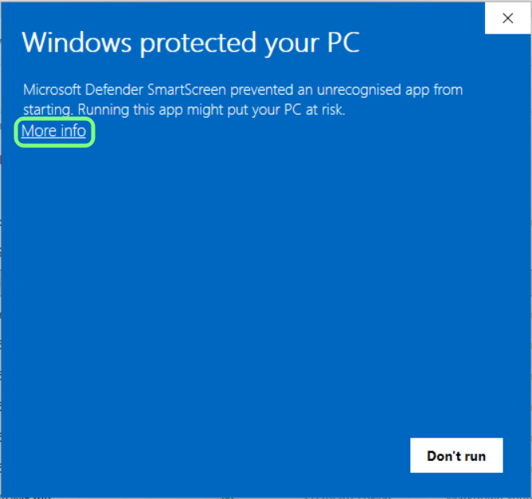
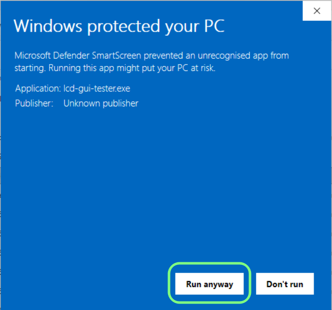

# LCD GUI Tester - User Instructions

## Supported Operating Systems

- **Windows 10/11 (64-bit)**
- **Linux x64** (Ubuntu 20.04+ or equivalent with glibc 2.31+)

## Prerequisites

### Application Pre-requirements

- **SEGGER J-Link Software**

  Download and install the J-Link Software and Documentation Pack from:

  https://www.segger.com/downloads/jlink/

  Select the appropriate version for your operating system (Windows, Linux, or macOS).

- **nrfutil 7.x or later** (the new Rust-based version)

  **Important:** The old Python-based nrfutil (version 5.x) is NOT compatible. The application requires the newer version which supports the `device` command.

  To check your nrfutil version:

  ```bash
  nrfutil version
  ```

  Expected output should show version 7.0.0 or higher:

  ```
  nrfutil 7.x.x
  ```

  To download and install the correct version:

  - Visit: https://www.nordicsemi.com/Products/Development-tools/nRF-Util

  - **Windows**: Use winget to install:

    1. Open PowerShell or Command Prompt:

       - Press **Windows + X** and select "Windows PowerShell" or "Terminal"
       - Or press **Windows + R**, type `powershell` or `cmd`, and press Enter

    2. Install nrfutil using winget:

       ```bash
       winget install nrfutil
       ```

    3. After installation, install the device command package:

       ```bash
       nrfutil install device
       ```

  - **Linux x64**: Download directly:

    ```bash
    wget -O nrfutil https://developer.nordicsemi.com/.pc-tools/nrfutil/x64-linux/nrfutil
    chmod +x nrfutil
    sudo mv nrfutil /usr/local/bin/
    nrfutil install device
    ```

  - **macOS**: Download the appropriate version from the Nordic website or use Homebrew if available. After installation, run:

    ```bash
    nrfutil install device
    ```

  If you have the old Python version installed, uninstall it first:

  ```bash
  pip uninstall nrfutil
  ```

## Installation Instructions

### Windows

1. Download the LCD GUI Tester application for Windows
2. Extract the archive to your desired location
3. Ensure nrfutil is installed (see Prerequisites above)
4. Run `lcd-gui-tester.exe`

### Linux

1. Download the LCD GUI Tester application for Linux
2. Extract the archive to your desired location
3. Ensure nrfutil is installed (see Prerequisites above)
4. Make the binary executable if needed:

   ```bash
   chmod +x lcd-gui-tester
   ```

5. Run the application:

   ```bash
   ./lcd-gui-tester
   ```

### macOS

1. Download the LCD GUI Tester application for macOS
2. Extract the archive to your desired location
3. Ensure nrfutil is installed (see Prerequisites above)
4. Run the application:

   ```bash
   ./lcd-gui-tester
   ```

## Using the Application

### Windows: First Run and SmartScreen Warning

When running the application for the first time on Windows, you may encounter a "Windows protected your PC" notification from Microsoft Defender SmartScreen. This occurs because the application is not digitally signed with a Microsoft-recognized certificate.

**This is normal and expected behavior.** To run the application:

1. When you see the first screen, click on **"More info"**:

   

2. After clicking "More info", a **"Run anyway"** button will appear. Click it to launch the application:

   

The application is safe to run. The SmartScreen warning appears only because the executable is not signed, not because there is any security risk.

### Basic Usage

1. Launch the LCD GUI Tester application
2. The main window provides an interface for LCD GUI testing
3. Use the image preview feature by dragging and dropping images
4. Execute LVGL scripts for testing display functionality

### Firmware Flashing

To flash firmware to your nRF52 device:

1. Ensure your nRF52 device is connected via USB
2. Use the firmware flashing feature in the application
3. Select the firmware file you wish to flash
4. Follow the on-screen prompts to complete the flashing process

## Troubleshooting

### nrfutil Issues

If you encounter errors related to nrfutil:

- Verify you have the correct version (7.x or later) by running `nrfutil version`
- If you have the old Python-based version, uninstall it with `pip uninstall nrfutil`
- Reinstall the correct version following the instructions in the Prerequisites section

### Common Issues

**Application won't start**
  - Ensure all Qt6 dependencies are installed
  - Check that your system meets the minimum requirements

**Firmware flashing fails**
  - Verify the nRF52 device is properly connected
  - Check that nrfutil is correctly installed and accessible in your PATH
  - Ensure you have the necessary permissions to access USB devices (Linux/macOS may require sudo or udev rules)
